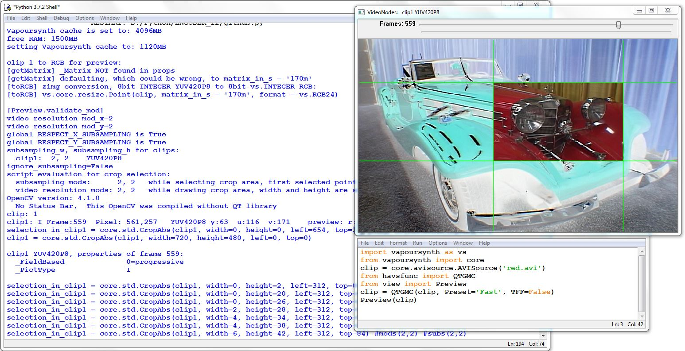

view.py is Python module for vapoursynth scripts that previews, compares VideoNodes (clips) within script itself by just running script.
It is using openCV to put vapoursynth's RGB on screen. 

<pre><code>Preview(list of clips or clip[, int[] frames=None, int delay=None, str img_dir=None, str matrix_in_s=None,
                          str kernel='Point', int mod_x=2, int mod_y=2, bool ignore_subsampling = False,
                          tuple position = (60,60), int preview_width = None, int preview_height = None,
                          bool output_window=False, bool fullscreen=False, bool play=False, bool slider=False ])</code></pre>

<h3>Basic usage:</h3>
<pre><code>import vapoursynth as vs
from view import Preview
clip = vs.core.lsmas.LibavSMASHSource('source.mp4')
Preview(clip)</code></pre>

                       
<h3>Dependencies:</h3>
vapoursynth 
numpy 
opencv 

<h3>Installations:</h3>
vapoursynth: http://www.vapoursynth.com/doc/installation.html 
numpy: <code>pip install numpy</code> 
opencv v.3.4.1 or higher. You do not need opencv build with Qt library. 
Status Bar is present if opencv is compiled with Qt library though. But at the same time Qt build blocks arrow keybindings. That is why frame step forward and back are not associated with arrow keys to make sure. 
But all sys.stdout are always printed into a tkinter window (output_window=True) or used Python console even if no Qt library is installed with opencv. 

On Windows  I used this build (without Qt Library): 
<code>python -m pip install opencv-contrib-python</code>  
On Linux, Ubuntu 16.04 I used this build (installed with Qt library):
<pre><code>sudo apt-get install libjpeg-dev libpng-dev libtiff-dev
sudo apt-get install libavcodec-dev libavformat-dev libswscale-dev libv4l-dev
sudo apt-get install libxvidcore-dev libx264-dev
sudo apt-get install libgtk-3-dev
sudo apt-get install libatlas-base-dev gfortran
sudo apt-get install python3-dev
sudo apt install python3-opencv</code></pre>

Put view.py and output_window.py into Pythons site-packages directory.
Make some Vapoursynth script in your favourite Python editor, IDLE or else, give it .py extension.
Run it your script, information is printed into a python console (output_window=False, which is default) or into tkinter pop up window (output_window=True).

<h3>If using within Vapoursynth Editor:</h3>
Use with <code>output_window=True</code> to actually see print-outs, because simple <code>print('something')</code> does not work while running a script in vsedit. 
If you keep getting ModuleNotFoundError: No module named 'view' put view.py and output_window.py into your Python's site-packages directory. 
You might include line to output your clip, even if not needed for preview: <code>clip.set_output()</code> 
If everything fails, you can always use your Python editor or IDLE where you can run your script. Using Preview() you do not need vapoursynth editor 

<h3>Script examples:</h3>
<pre><code>#all arguments
import vapoursynth as vs
from view import Preview
clip = vs.core.ffms2.Source('source.mp4')
clip_fixed = clip.std.Expr(['x 20 -','',''])  #darken luma
Preview(clips=[clip, clip_fixed], frames=[0,2000], delay=20, img_dir=r'F:\images', matrix_in_s = '709',
                           kernel='Point', mod_x=4, mod_y=4, ignore_subsampling = False,
                           position = (100,100), preview_width = 640, preview_height = 360,
                           output_window=False, fullscreen=False, play=False, slider=False)</code></pre>

<pre><code>
#passing crop values back to script
#(besides simple copy/paste cropping line that can be done during any crop)
import vapoursynth as vs
from view import Preview
clip = vs.core.lsmas.LibavSMASHSource('source.mp4')
p = Preview(clip)  #and cancel preview window while in desired crop selection
cropped_clip = clip.std.CropAbs(width=p.width, height=p.height, left=p.left, top=p.top)
Preview(cropped_clip)</code></pre>

<pre><code>#saving cropped PNG's to disk with no subsampling restraines or mods:
import vapoursynth as vs
from view import Preview
clip = vs.core.lsmas.LibavSMASHSource('source.mp4')
Preview(clip, img_dir=r'F:\images', mod_x=1, mod_y=1, ignore_subsampling=True)
#while in preview to save image in window pres 'W' (1:1 pixels) or 'E' (exact window copy) to 'images' directory
</code></pre>

<pre><code>#color range, full vs. limited:
import vapoursynth as vs
from view import Preview
clip = vs.core.lsmas.LibavSMASHSource('source.mp4')
clip = vs.core.std.SetFrameProp(clip, prop="_ColorRange", intval=1)
clip1 = vs.core.std.SetFrameProp(clip, prop="_ColorRange", intval=0)
Preview([clip, clip1]) 
#switch clips pressing keys '1' and '2' while playing, or zoom-in couple of times
#and notice, the same YUV values, but different rgb values for those clips</code></pre>

<pre><code>#Creating 10 clips with different shades of gray and passing them to Preview
import vapoursynth as vs
from view import Preview

DEPTH = 10   #8 to 16

format = core.register_format(vs.ColorFamily.YUV, vs.INTEGER, DEPTH, 1, 1).id
max  = 2**DEPTH
step = max//9
color= [max-1, max//2, max//2]
clip = vs.core.std.BlankClip(width=1280, height=720, format=format, color=color)               
shades_of_gray = [ clip.std.Expr([f'x {dimming} -','','']) for dimming in range(0, max, step) ]
#in Preview window pressing keys '1' to '9' or '0' to select a clip
#press "I" with mouse over window to read pixel values
Preview(shades_of_gray)</code></pre>

<h3>Preview class arguments:</h3>
<pre><code><b>list  clips</b>
list of clips (vapoursynth VideoNodes)
if there is only one clip passed, it could be passed as a simple clip (VideoNode).

<b>list  frames</b>
is a list with first frame and last frame+1,
if not specified, default is all frames.
Same list as you'd make slicing in vapoursynth clip=clip[some frame:other frame]
Seeking a frame is a source plugin dependant, it could take a time to seek n-th frame,
it could take much longer than seeking subsequece frames, or it could fail, or proper seeking have to be specified
as source plugin argument.
                       
<b>int  delay</b>
is delay for playback in milliseconds between frames,
if not specified, delay is taken from a first clip fps, using fps_num and fps_den                      
                       
<b>string  img_dir</b>
is a string path for directory to save 8bit PNG images, if keys 'w' or 'e' are pressed, example:
windows:  img_dir = r'E:\images'
linux:    img_dir = /home/username/Documents/images
if path is not provided, png's will be written into scripts directory

<b>string  matrix_in_s</b>
To override matrix_in_s for YUV to RGB conversion for preview, FOR ALL CLIPS.
Only applies to YUV clips.
The way YUV-> RGB conversion works within this script, is that proper matrix_in
is being pulled from Vapoursynth props: matrix_in = clip.get_frame(0).props["_Matrix"].
If it is usable value, matrix_in is used for YUV to RGB conversion.
If that value is not usable, like  matrix_in = 2 ('unspec' ), matrix_in is defaulted then.
Anything from 1024x576 up, matrix_in is 1 ( '709'), below defaults to:
     if   clip.width <= 1024 and clip.height <= 480: matrix_in, matrix_in_s = (6, '170m')
     elif clip.width <= 1024 and clip.height <= 576: matrix_in, matrix_in_s = (5, '470bg')
But default translates to: "It could be wrong!".
So if you do not want to default while matrix is not set in vapoursynth props, you have some choices,

       -to specify color space by this argument, for example:
        Preview(clip, matrix_in_s='709') #but that would be applied for all clips if there are
       -you just register '_Matrix' prop in Vapoursynth for clip to make sure, before you call Preview():
        clip = core.std.SetFrameProp(clip, prop="_Matrix", intval=1)
        Preview(clip)
        or
       -you just know, after some experience,  that your Source plugin and type of video you work with
        always generate _Matrix value correctly and you do not care
        or
       -you change it in Vapoursynth to 8bit RGB24 ANY WAY YOU WANT before calling Preview(),
        then zimg just copies RGB planes for preview on screen, it has to be RGB24 though
                            
matrix_in : matrix_in_s
1 : '709'
4 : 'fcc'
5 : '470bg'
6 : '170m'
7 : '240m'
8 : 'ycgco'
9 : '2020ncl'
10 : '2020cl'
12 : 'chromancl'
13 : 'chromacl '
14 : 'ictcp'

The resolution is, there is no way to get correct RGB colors trying to play YUV video automatically
and be always correct at the same time.
If there is no matrix flag in video that vapoursynth source plugin can pass into script (into _Matrix prop)
then defaults are selected.                      
This goes for any video player out there. If that color space info , flag is not present or wrong
or videoplayer can default to wrong color space.
If video player does not know proper color space, it defaults to something and it could be wrong.
That is why explaining all the details above so colors are correct during preview.
Good habit is to flag color space while encoding, exactly for the reasons above,
so video players AND vapoursynth Source plugin can identify color space later.
                       
<b>string kernel</b>
default: 'Point', same a Vapoursynth resize attributes: 'Point','Bicubic','Lanczos','Spline16','Spline36'                     

<b>int  mod_x , int mod_y</b>
while cropping and zooming, width and height snaps to lenghts respecting those mods,
if arguments are not provided, defalts are 2 and 2
Values could be any integers, so if not defaulting, choose some sane values: 2,4,8 or 16
tip:
Preview(clip, ignore_subsampling=True,  mod_x=1, mod_y=1, img_dir='F:\images')
This way any pixel could be selected and cropping is done to any lenghts. This is handy if writing some cropped PNG's
in a row for GIF creating etc. (holding key 'w' down, while playing a clip would write PNG's on disk continuously)
                       
<b>bool ignore_subsampling</b>
False value guarantees snapping while cropping is subsampling safe, it snaps to legal values.
You want to leave it False as default, so cropping respects subsampling,
otherwise if using those crop lines in Vapoursynth later on, you do not get errors.
But if you do anyway, setting ignore_subsampling=True,
there will be warning printed next to the crop line ,about vapoursynth failing, if using in your Vapoursynth script.
Cropping lines will be red , not green.
Reason to ignore subsumpling? When getting RGB images for gifs  (maybe together with: mod_x=1, mod_y=1 to also allow wny width and height)
Or other reason, you do not care about having it legal in vapoursynth, because you just inspect video on screen.
                       
<b>bool  output_window</b>
default is False,
needs Python tkinter module to be in PATH. Tkinter is used to create output window.
if True and output_window.py is in PATH, print is redirected to tkinter window.
False or no output_window.py present in PATH prints logs into regular python console if there is.
If using Vapoursynth editor, you have to have that output_window.py to see the output logs printed, so set it to True
(or there are at least one liner infos in statusbar if opencv was compiled with Qt library)
                       
<b>bool  fullscreen</b>
sets fullscreen when app starts

<b>bool  play</b>
If True, it starts playing when app starts
                       
<b>bool  slider</b>
show slider or not
Toggle anytime later with key 's' to show or destroy slider.
With slider on, you cannot manually resize that Preview window on your monitor screen,
this is opencv limitation.
Also, seeking could be dragging or freezing, it depends on video, clip's source plugin and source plugin arguments.

</code></pre>

<h3>Keybindings:</h3>
<code><pre>Check global variables WINDOWS_KEYMAP  and LINUX_KEYMAP.
Not sure about Mac at all about correct keybindings, just have set it same as for Linux,
so it might need corrections, if things do not work,see global DARWIN_KEYMAP and change keybindings apropriatelly.
Active (selected/focused) opencv  window response to these keys on keyboard:

Keys '1' to '9' and '0' to switch between clips to compare them if loading more clips.
           So there is max 10 clips. But technically, it could be more if keybinding is adjusted.
           
MOUSE LEFT DOUBLECLICK    zooms in 2x, centers on mouse position
'Z' -      same as above, zooms in 2x as well, again centers on mouse position
MOUSE LEFT CLICK and MOVE  initiates crop mode, selecting rectangle with mouse, confirmcrop  with ENTER KEY
           or with DOUBLECLICK inside of selected area or with RIGHT MOUSE CLICK
           while touching first anchor point, it snaps to to a pixel following subsumpling,
           also while drawing a rectangle , it snaps to mods (2,4,8 or 16), whatever is passed as argument
           default modes:  mod_x=2, mod_y=2
key 'Z' -  zooms 2x in as well, again using mouse to be a center if available
key 'R' -  RESETs preview to original 1:1 clip on screen
key 'I' -  prints YUV or RGB values for pixel under mouse pointer in preview window
           printing is in this format:
           clip number, _PictType (I,B or P), frame number ,absolute pixel coordinates, original clip YUV or RGB values,
           preview RGB values
key 'P'    prints all available frame properties (_PictType, _Matrix, _Primaries ...etc.)           
key 'W' -  save PNG image, what you just preview and it will be saved on hardisk as 8bit PNG as 1:1, ingnoring zoom that you have on screen
key 'E' -  save PNG image, what you just preview and it will be saved on hardisk as 8bit PNG, it will be saved as you see on screen, respecting zoom, pixel blocks
key Spacebar  -   Play/Pause switch
key ',' -  '<'  step one frame back
key '.' -  '>'  step one frame forward
'Home'  -  go to first frame
'End'   -  go to last frame
           Seeking is source plugin dependant so it could take a time and window could freeze for a while.
key 'Esc'  returns to PREVIOUS zoom or crop
key  'Q'   Quits app.
key 'S'    Slider on/off,
           Seeking is source plugin dependant, could be major problem,
           so moving slider might have conciderable delay and freeze
key 'F'    Fullscreen on/off switch
key 'H'    help, prints this keybinding text into console</code></pre>

